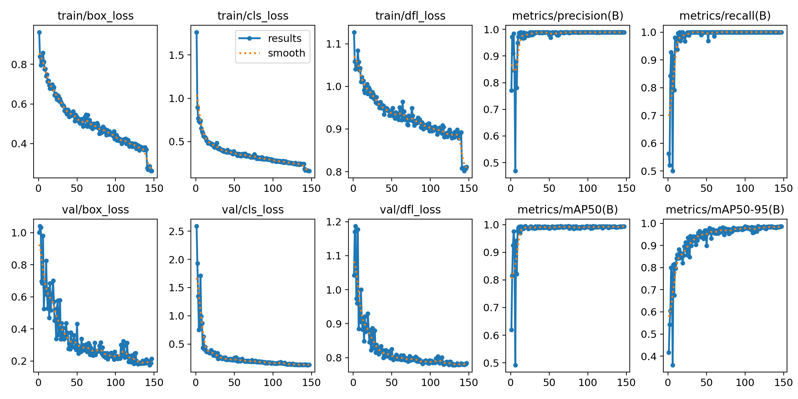
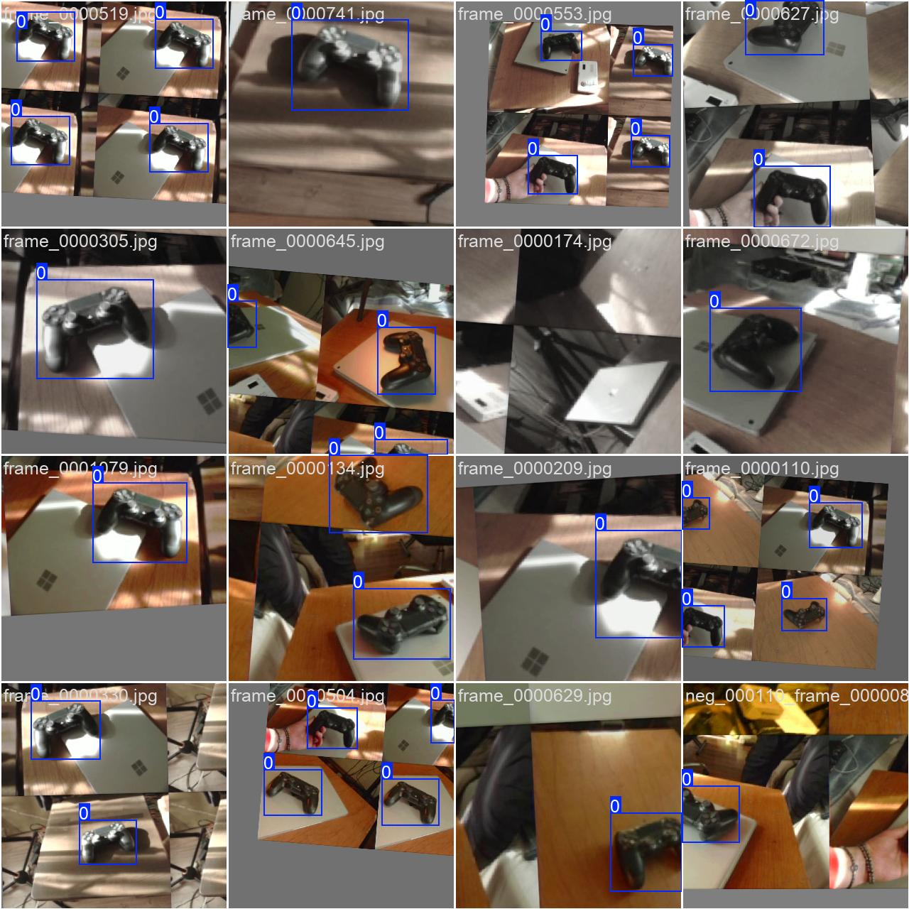

# Jetson YOLO Realtime Test

Realtime детекція джойстика на **Jetson Nano 4GB** з USB-камери (PS3 Eye):

- train на ПК (YOLOv8, `imgsz=320`)
- export в ONNX
- TensorRT FP16 engine на Jetson
- live preview з bbox + FPS

## Що вже є в репозиторії

- `scripts/realtime_camera_test.py` - headless/live тест камери + TensorRT inference + FPS/latency JSON
- `scripts/live_preview.sh` - запуск live-вікна однією командою на Jetson
- `src/train/train_yolo.py` - train-скрипт для YOLOv8
- `run.txt` - робочий runbook з командами для Jetson
- `artifacts/joystick.onnx` - експортована ONNX модель

## Останній train run (базовий)

В репозиторій додано фінальний run, з якого взято поточну модель:

- `runs/detect/joystick_320_neg_v4`
- основні файли: `weights/best.pt`, `weights/best.onnx`, `results.csv`, `args.yaml`

`results.png`:






## Вимоги

### ПК (тренування)

- Python 3.10+
- CUDA GPU (бажано)
- залежності з `requirements.txt`

### Jetson Nano

- JetPack 4.x (L4T r32.x)
- Docker + NVIDIA runtime
- TensorRT (`trtexec`)
- USB камера на `/dev/video0`
- X11 desktop для live-вікна

## Швидкий старт

### 1) Train на ПК

```bash
python -m venv .venv
source .venv/bin/activate
pip install -r requirements.txt

python src/train/train_yolo.py \
  --data data/dataset.yaml \
  --model yolov8n.pt \
  --imgsz 320 \
  --epochs 150 \
  --batch 32 \
  --device 0
```

### 2) Export в ONNX

```bash
yolo export model=runs/detect/joystick_320/weights/best.pt format=onnx opset=12 imgsz=320 simplify=True dynamic=False
```

Поклади ONNX у `artifacts/joystick.onnx`.

### 3) Build TensorRT engine на Jetson

```bash
/usr/src/tensorrt/bin/trtexec \
  --onnx=/home/kolins/jetson-yolo/artifacts/joystick.onnx \
  --saveEngine=/home/kolins/jetson-yolo/artifacts/joystick_fp16.engine \
  --fp16 --workspace=1024 --minTiming=1 --avgTiming=1
```

### 4) Headless realtime тест на Jetson

```bash
sudo docker run --rm --runtime nvidia --network host --ipc host \
  --device=/dev/video0 --group-add video \
  -v /home/kolins/jetson-yolo:/workspace -w /workspace \
  nvcr.io/nvidia/l4t-ml:r32.7.1-py3 \
  python3 /workspace/scripts/realtime_camera_test.py \
  --camera 0 --frames 300 --imgsz 320 --conf 0.6 --iou 0.7 \
  --save-json /workspace/outputs/realtime_test.json
```

### 5) Live preview (вікно) на Jetson

Запускати з локальної GUI-сесії Jetson (не з headless SSH):

```bash
bash /home/kolins/jetson-yolo/scripts/live_preview.sh
```

Налаштування через аргументи:

```bash
bash /home/kolins/jetson-yolo/scripts/live_preview.sh <frames> <imgsz> <conf> <iou> <max_det>
```

Приклад:

```bash
bash /home/kolins/jetson-yolo/scripts/live_preview.sh 999999 320 0.6 0.7 10
```

Вихід: `Q` або `Esc`.

## Корисно

- Повний runbook: `run.txt`
- Лог навантаження: `tegrastats --interval 1000 | tee outputs/tegrastats.log`
- Базовий benchmark engine: `trtexec --loadEngine=... --duration=10`

## Roadmap (поточний статус)

- [x] Train YOLOv8 (`imgsz=320`)
- [x] Export ONNX
- [x] Build TensorRT FP16 engine
- [x] Realtime headless camera test
- [x] Realtime live preview з вікном
- [ ] REPORT.md з p50/p95 + tegrastats summary
