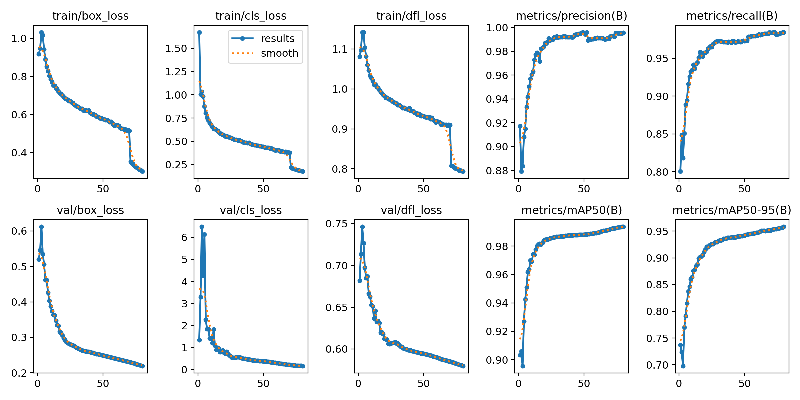
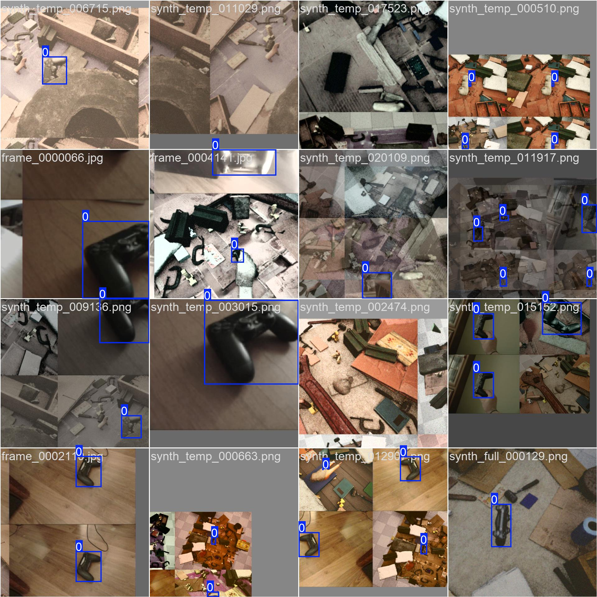
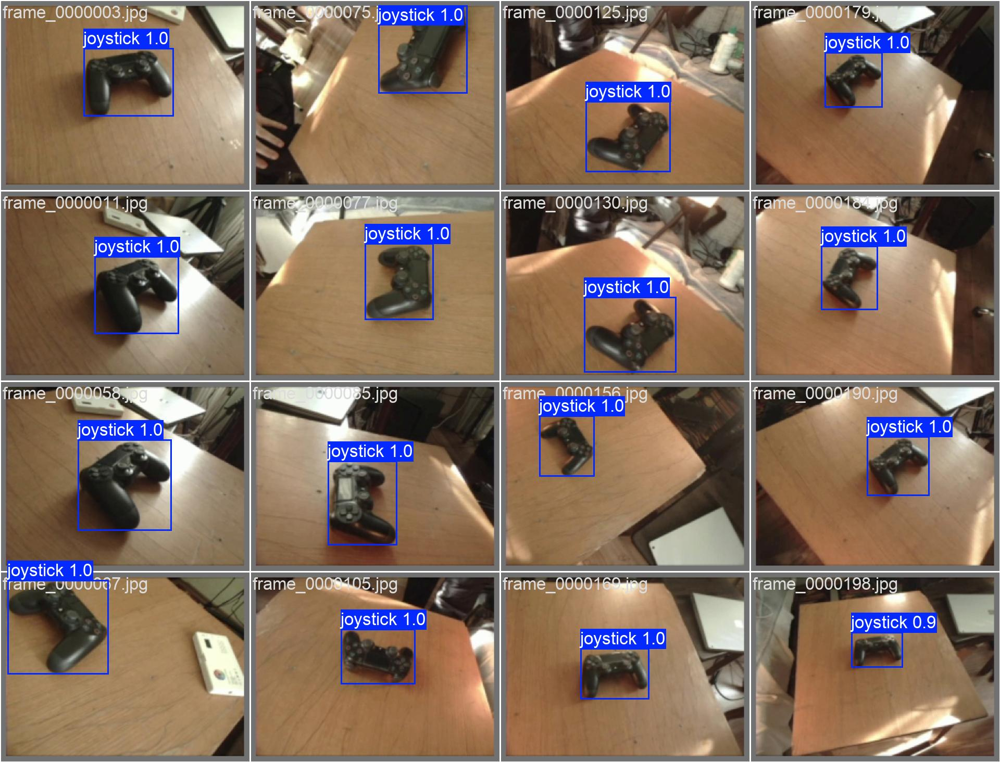
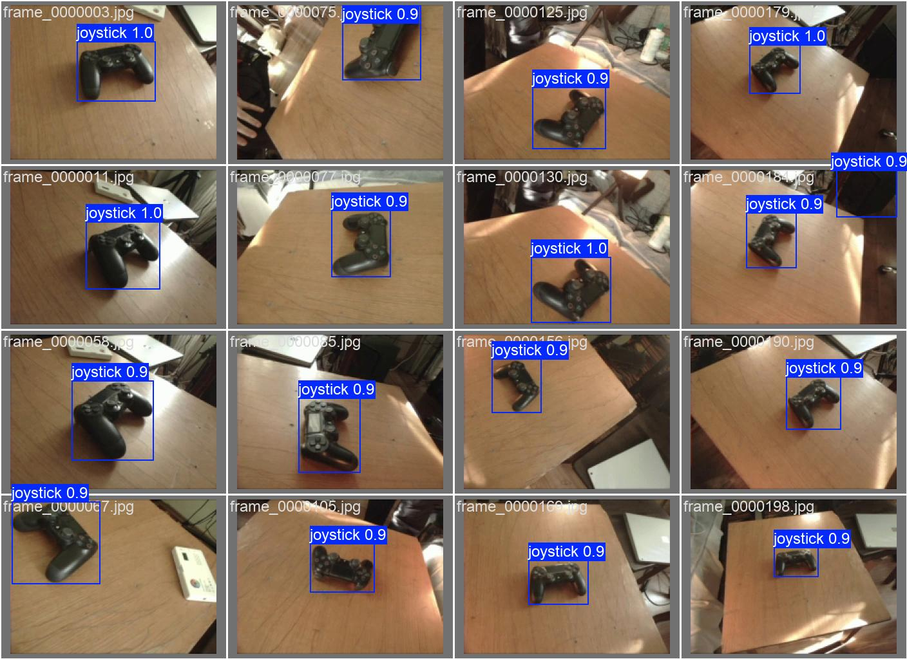
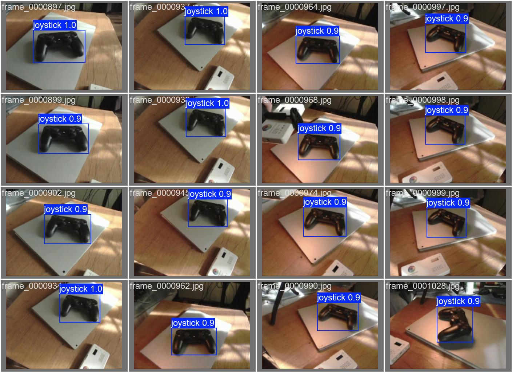
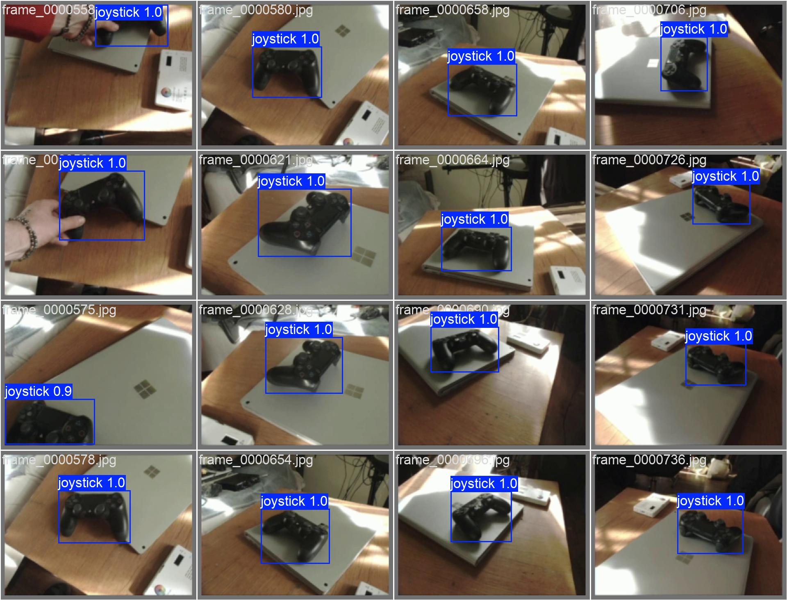
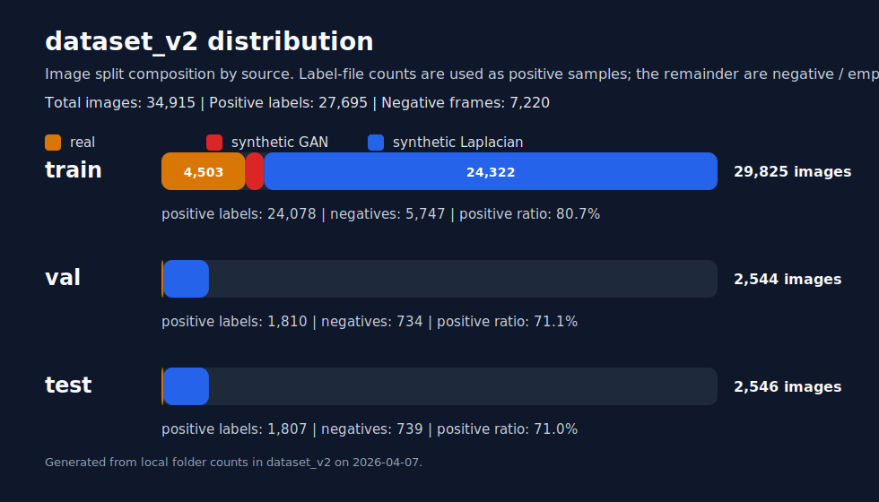
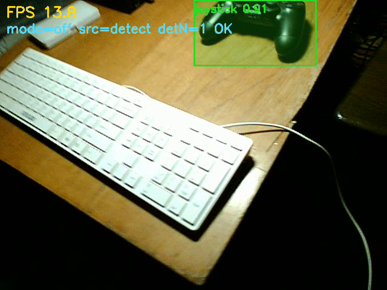
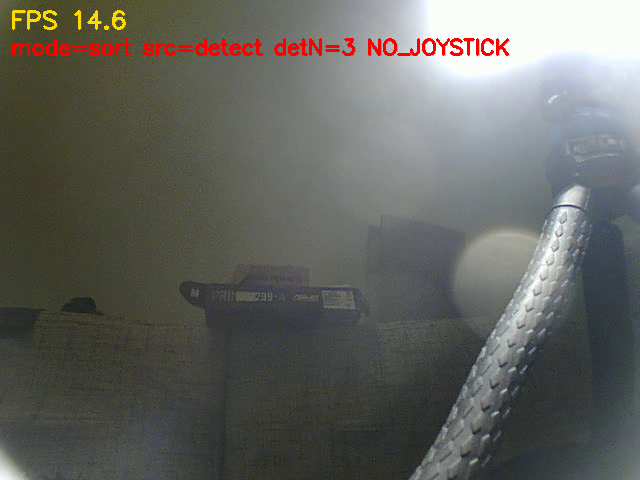

# Jetson YOLO Realtime (Single object detection and tracking)

Real-time object detection on Jetson Nano 4GB (PS3 Eye camera), with TensorRT FP16 and tracking-by-detection.

This repository now has two important reference points:

- `runs/detect/joystick_320_neg_v4`: earlier baseline run trained on the older `data/dataset.yaml`
- `runs/detect/train4`: current synthetic-augmented deployment candidate trained on `dataset_v2/dataset.yaml`

The key caveat is that these runs are not apples-to-apples: they use different datasets, different image sizes, and different training schedules. The README keeps both because the old run is still the only one with published Jetson runtime evidence, while `train4` is the current candidate to export and redeploy.

## Current Status

- Current deployment candidate: `runs/detect/train4`
- Current dataset: `dataset_v2/dataset.yaml`
- Next deploy step: `train4/best.pt -> ONNX -> TensorRT -> fresh Jetson benchmark`
- Existing Jetson runtime evidence: captured on February 26-27, 2026, before the `train4` refresh

## Training Comparison

Comparison below is directional only. `joystick_320_neg_v4` used `data/dataset.yaml` at `imgsz=320`, while `train4` used `dataset_v2/dataset.yaml` at `imgsz=640` with synthetic augmentation.

| Run | Dataset | Img Size | Epochs | Precision | Recall | mAP50 | mAP50-95 | Notes |
|---|---|---:|---:|---:|---:|---:|---:|---|
| `joystick_320_neg_v4` | `data/dataset.yaml` | 320 | 150 | 0.98893 | 1.00000 | 0.99211 | 0.98741 | earlier baseline, best `mAP50-95` at epoch 117 |
| `train4` | `dataset_v2/dataset.yaml` | 640 | 80 | 0.99552 | 0.98439 | 0.99372 | 0.95827 | current synthetic-augmented candidate, best metrics at epoch 80 |

## Latest Training Visuals (`train4`)

| Metrics curve | 
|---|
|  |
Representative batches:

| Train batch | Validation prediction |
|---|---|
|  |  |

## Validation Snapshots: Before / After Synthetic

These images are included as representative validation snapshots from two different training eras. They are useful for qualitative inspection, but they are not frame-aligned A/B pairs from the same exact validation set.

| Baseline `joystick_320_neg_v4` | Current candidate `train4` |
|---|---|
|  |  |

| Baseline second snapshot | Current candidate second snapshot |
|---|---|
|  |  |

## Dataset Composition (`dataset_v2`)

Dataset structure overview:



Split and source distribution:



Source totals:

| Source | Train Images | Val Images | Test Images | Total Images | Positive Labels |
|---|---:|---:|---:|---:|---:|
| `real` | 4,503 | 112 | 113 | 4,728 | 4,710 |
| `synth_gan` | 1,000 | 0 | 0 | 1,000 | 683 |
| `synth_lap` | 24,322 | 2,432 | 2,433 | 29,187 | 22,302 |
| **Total** | **29,825** | **2,544** | **2,546** | **34,915** | **27,695** |

The remaining `7,220` frames are negative / empty frames with no label file.

## Jetson Runtime Evidence

The following benchmark data is intentionally preserved in the README. These are real Jetson host measurements from February 26-27, 2026, and they should not disappear just because `train4` is the next model to deploy.

Source files in local `outputs/`:

- `realtime_test.json`
- `prof_off_noviz.json`
- `prof_sort_noviz.json`
- `perf_vs2_mp4v.json`
- `trtexec_live.txt`
- `tegrastats_live.log`

### Latest Benchmarks (Jetson Host)

| Mode | FPS | Infer p50 | Notes |
|---|---:|---:|---|
| `off`, no video | 22.04 | 20.58 ms | detector every frame, `outputs/prof_off_noviz.json` |
| `sort`, no video | 22.62 | 20.51 ms | `det=3`, `track=2`, `outputs/prof_sort_noviz.json` |
| `sort`, video `mp4v`, `video-skip=2` | 28.73 | 15.73 ms | highest measured throughput, writer becomes bottleneck, `outputs/perf_vs2_mp4v.json` |
| realtime camera smoke | 20.19 | 26.39 ms | short 30-frame camera sample, `outputs/realtime_test.json` |

Engine-only sample from `outputs/trtexec_live.txt`:

- throughput: `57.57 qps`
- latency mean: `17.06 ms`
- latency p99: `34.65 ms`

Tegrastats summary from `outputs/tegrastats_live.log`:

- RAM used min/max/avg: `1452 / 3616 / 1586 MB`
- GR3D freq min/max/avg: `0 / 99 / 7.8 %`
- CPU average load min/max/mean: `0.5 / 74.8 / 7.5 %`

These runtime metrics predate the `train4` export. After the next deploy, this section should be updated with a fresh `train4` engine and a new camera demo.

## Jetson Demo Assets

Current README demo assets are taken from the existing Jetson baseline runtime capture, not yet from the refreshed `train4` deploy.

- [Jetson sort demo clip](docs/jetson_sort_demo.mp4)

| Detector-only frame | Tracking-by-detection frame |
|---|---|
|  |  |

## Deployment Path

1. Export ONNX from the local `train4` checkpoint on the training machine:

```powershell
.venv\Scripts\yolo.exe export model=runs/detect/train4/weights/best.pt format=onnx imgsz=640 simplify=True
Copy-Item runs\detect\train4\weights\best.onnx artifacts\joystick.onnx
```

2. Build the TensorRT engine on Jetson:

```bash
bash scripts/build_engine.sh
```

3. Run realtime inference:

```bash
python3 -m src.app \
  --engine artifacts/joystick_fp16.engine \
  --tracker sort --det-interval 3 --track-interval 2 \
  --overlay-alpha 0.15 --preview-skip 2 \
  --video-skip 2 --video-codec mp4v
```

4. Refresh:

- Jetson benchmark JSON files
- tegrastats summary
- post-`train4` demo video
- README screenshots from the new runtime

For the full Jetson deploy runbook, see `run.txt`.

## Notes

- `dataset_v2/`, synthetic outputs, `data/`, `outputs/`, `*.engine`, and helper/dev artifacts are ignored.
- `runs/detect/train4/weights/*.pt` remain local-only; Git keeps only lightweight plots and CSV/YAML metadata for the reference run.
- TensorRT `.engine` files are built on target Jetson and are not committed.
- `CSRT` may be unavailable in host OpenCV builds; runtime falls back to `sort`.
