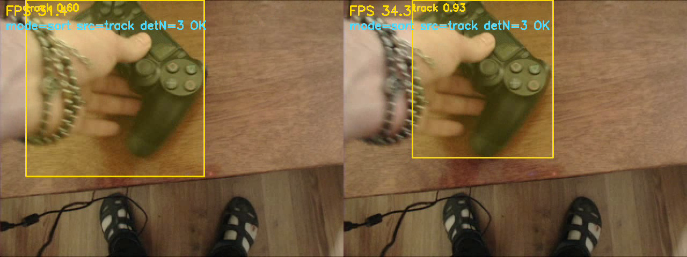
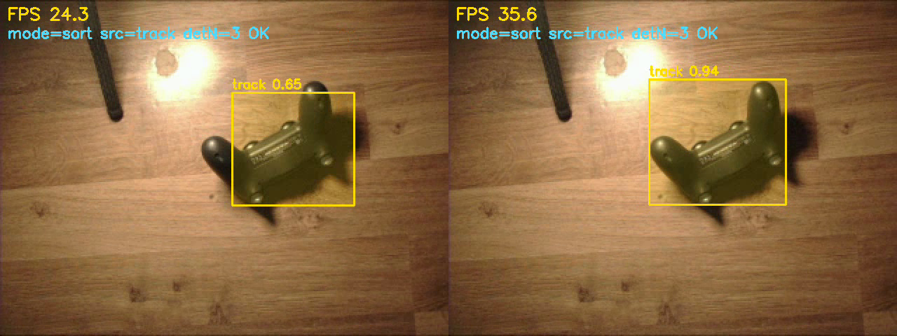

# Jetson YOLO Realtime (Single object detection and tracking)

Real-time object detection on Jetson Nano 4GB (PS3 Eye camera), with TensorRT FP16 and tracking-by-detection.

This repository now has two important reference points:

- `runs/detect/joystick_320_neg_v4`: earlier baseline run trained on the older `data/dataset.yaml`
- `runs/detect/train4`: current synthetic-augmented deployment candidate trained on `dataset_v2/dataset.yaml`

The key caveat is that these runs are not apples-to-apples: they use different datasets, different image sizes, and different training schedules. The README keeps both because the old run remains the baseline reference, while `train4` now has fresh Jetson prerecorded A/B evidence and is the active deployment target.

## Current Status

- Current deployment candidate: `runs/detect/train4`
- Current Jetson A/B export: `artifacts/train4_320_fp16.engine`
- Current dataset: `dataset_v2/dataset.yaml`
- Fresh Jetson fast-path evidence: captured on April 7-8, 2026 on prerecorded clips
- Next deploy step: repeat the same A/B on live camera and record a new final demo clip

## Training Comparison

Comparison below is directional only. `joystick_320_neg_v4` used `data/dataset.yaml` at `imgsz=320`, while `train4` used `dataset_v2/dataset.yaml` at `imgsz=640` with synthetic augmentation.

| Run | Dataset | Img Size | Epochs | Precision | Recall | mAP50 | mAP50-95 | Notes |
|---|---|---:|---:|---:|---:|---:|---:|---|
| `joystick_320_neg_v4` | `data/dataset.yaml` | 320 | 150 | 0.98893 | 1.00000 | 0.99211 | 0.98741 | earlier baseline, best `mAP50-95` at epoch 117 |
| `train4` | `dataset_v2/dataset.yaml` | 640 | 80 | 0.99552 | 0.98439 | 0.99372 | 0.95827 | current synthetic-augmented candidate, best metrics at epoch 80 |

## Latest Training Visuals (`train4`)

| Metrics curve | 
|---|
|  |
Representative batches:

| Train batch | Validation prediction |
|---|---|
|  |  |

## Validation Snapshots: Before / After Synthetic

These images are included as representative validation snapshots from two different training eras. They are useful for qualitative inspection, but they are not frame-aligned A/B pairs from the same exact validation set.

| Baseline `joystick_320_neg_v4` | Current candidate `train4` |
|---|---|
|  |  |

| Baseline second snapshot | Current candidate second snapshot |
|---|---|
|  |  |

## Dataset Composition (`dataset_v2`)

Dataset structure overview:


Source totals:

| Source | Train Images | Val Images | Test Images | Total Images | Positive Labels |
|---|---:|---:|---:|---:|---:|
| `real` | 4,503 | 112 | 113 | 4,728 | 4,710 |
| `synth_gan` | 1,000 | 0 | 0 | 1,000 | 683 |
| `synth_lap` | 24,322 | 2,432 | 2,433 | 29,187 | 22,302 |
| **Total** | **29,825** | **2,544** | **2,546** | **34,915** | **27,695** |

The remaining `7,220` frames are negative / empty frames with no label file.

## Synthetic Data Pipeline

The Unreal/Houdini-side synthetic generator now lives in a separate repository:

- [`cyberpodolia/Jetson-syntetic-Unreal-Houdini`](https://github.com/cyberpodolia/Jetson-syntetic-Unreal-Houdini)

Short pipeline:

1. `Jetson-syntetic-Unreal-Houdini` renders synthetic samples as `rgb/`, `mask/`, and `meta/` outputs.
2. This repository consumes those rendered outputs and assembles mixed YOLO datasets together with real frames.
3. The mixed dataset is trained here, producing runs such as `runs/detect/train4`.
4. The selected checkpoint is exported to ONNX, converted to TensorRT on Jetson, and benchmarked in the realtime runtime.

The split is intentional: Unreal/Houdini scene generation stays in the synthetic repo, while `jetson-yolo` stays focused on dataset packaging, training, export, deployment, and Jetson-side evaluation.

## Jetson Runtime Evidence

The README now keeps two runtime evidence sets:

- historical baseline camera/host measurements from February 26-27, 2026
- fresh post-`train4` prerecorded A/B measurements from April 7-8, 2026

### Historical Baseline Camera Benchmarks (February 26-27, 2026)

Source files in local `outputs/`:

- `realtime_test.json` 
- `prof_off_noviz.json`
- `prof_sort_noviz.json`
- `perf_vs2_mp4v.json`
- `trtexec_live.txt`
- `tegrastats_live.log`

Jetson host results:

| Mode | FPS | Infer p50 | Notes |
|---|---:|---:|---|
| `off`, no video | 22.04 | 20.58 ms | detector every frame, `outputs/prof_off_noviz.json` |
| `sort`, no video | 22.62 | 20.51 ms | `det=3`, `track=2`, `outputs/prof_sort_noviz.json` |
| `sort`, video `mp4v`, `video-skip=2` | 28.73 | 15.73 ms | highest measured throughput, writer becomes bottleneck, `outputs/perf_vs2_mp4v.json` |
| realtime camera smoke | 20.19 | 26.39 ms | short 30-frame camera sample, `outputs/realtime_test.json` |

Engine-only sample from `outputs/trtexec_live.txt`:

- throughput: `57.57 qps`
- latency mean: `17.06 ms`
- latency p99: `34.65 ms`

Tegrastats summary from `outputs/tegrastats_live.log`:

- RAM used min/max/avg: `1452 / 3616 / 1586 MB`
- GR3D freq min/max/avg: `0 / 99 / 7.8 %`
- CPU average load min/max/mean: `0.5 / 74.8 / 7.5 %`

### Fresh Fast-Path A/B on Prerecorded Clips (April 7-8, 2026)

For a fair Jetson comparison, the `train4` checkpoint was exported at `320` and built as `artifacts/train4_320_fp16.engine`. The older baseline was rebuilt natively on the same Jetson as `artifacts/joystick_320_fp16_native.engine`. Both were evaluated through the high-throughput runtime path in `src.app` with:

- `tracker=sort`
- `det-interval=3`
- `track-interval=2`
- `video-skip=2`
- `video-codec=mp4v`

| Clip | Baseline FPS | `train4` FPS | Delta FPS | Baseline infer p50 | `train4` infer p50 | Baseline det ratio | `train4` det ratio |
|---|---:|---:|---:|---:|---:|---:|---:|
| `session_0002_30s` | 32.96 | 34.99 | +2.03 | 13.70 ms | 13.23 ms | 0.9011 | 0.9989 |
| `session_0005_60s_30s` | 24.78 | 35.74 | +10.96 | 13.75 ms | 13.27 ms | 0.3289 | 1.0000 |

Key takeaway:

- On the easier `session_0002` clip, `train4` still wins on both throughput and detection coverage.
- On `session_0005`, the older baseline loses track often enough that `train4` ends up much faster because it needs fewer detector reacquires.

Artifacts in `docs/fastpath_compare/`:

- `session_0002_30s`: [baseline mp4](docs/fastpath_compare/baseline_sort_20260408_session0002.mp4), [train4 mp4](docs/fastpath_compare/candidate_sort_20260408_session0002.mp4), [side-by-side frame](docs/fastpath_compare/compare_sort_20260408_session0002_7s_side_by_side.png)
- `session_0005_60s_30s`: [baseline mp4](docs/fastpath_compare/baseline_sort_20260407_session0005.mp4), [train4 mp4](docs/fastpath_compare/candidate_sort_20260407_session0005.mp4), [side-by-side frame](docs/fastpath_compare/compare_sort_20260407_session0005_7s_side_by_side.png)

| `session_0002_30s` | `session_0005_60s_30s` |
|---|---|
|  |  |

## Deployment Path

1. Export ONNX from the local `train4` checkpoint on the training machine.
For a fair Jetson A/B against the old `320` baseline, export `train4` at `320` too:

```powershell
.venv\Scripts\yolo.exe export model=runs/detect/train4/weights/best.pt format=onnx imgsz=320 simplify=True
Copy-Item runs\detect\train4\weights\best.onnx artifacts\train4_320.onnx
```

2. Build both TensorRT engines on Jetson:

```bash
bash scripts/build_engine.sh artifacts/train4_320.onnx artifacts/train4_320_fp16.engine
bash scripts/build_engine.sh artifacts/joystick.onnx artifacts/joystick_320_fp16_native.engine
```

3. Run the high-FPS prerecorded benchmark path:

```bash
python3 -m src.app \
  --engine artifacts/train4_320_fp16.engine \
  --video docs/test_inputs/session_0002_30s.mp4 \
  --frames 900 \
  --tracker sort --det-interval 3 --track-interval 2 \
  --overlay-alpha 0.15 \
  --video-skip 2 --video-codec mp4v \
  --save-video outputs/train4_sort.mp4 \
  --save-json outputs/train4_sort.json
```

4. Run live camera inference when you want the final on-device demo:

```bash
python3 -m src.app \
  --engine artifacts/train4_320_fp16.engine \
  --camera 0 --frames 300 \
  --tracker sort --det-interval 3 --track-interval 2 \
  --overlay-alpha 0.15 --preview-skip 2 \
  --video-skip 2 --video-codec mp4v
```

5. Refresh:

- Jetson benchmark JSON files
- tegrastats summary
- `docs/fastpath_compare/` mp4/png assets
- final live demo video

For the full Jetson deploy runbook, see `run.txt`.

## Notes

- `dataset_v2/`, synthetic outputs, `data/`, `outputs/`, `*.engine`, and helper/dev artifacts are ignored.
- `runs/detect/train4/weights/best.pt` and `best.onnx` are tracked as reference artifacts; `last.pt` remains local-only.
- TensorRT `.engine` files are built on target Jetson and are not committed.
- `CSRT` may be unavailable in host OpenCV builds; runtime falls back to `sort`.
